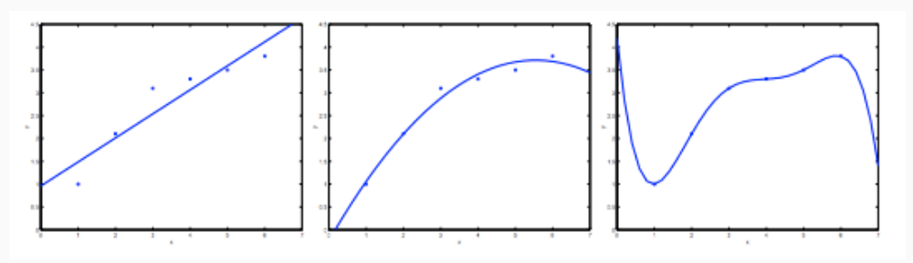
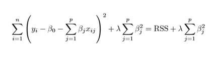
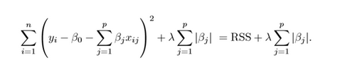
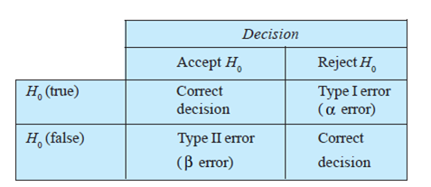
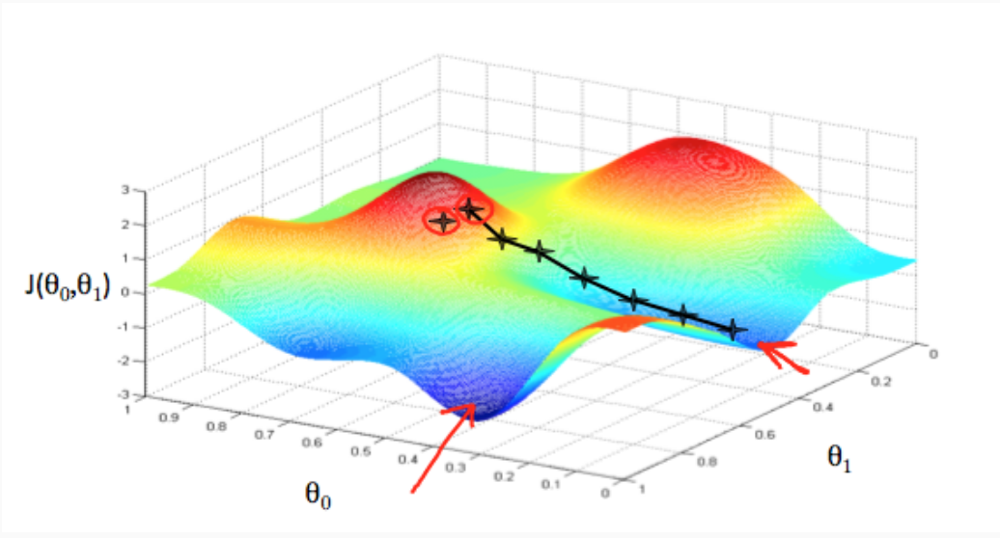
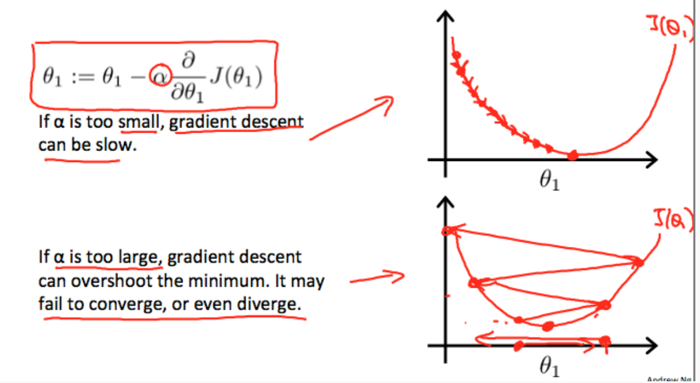
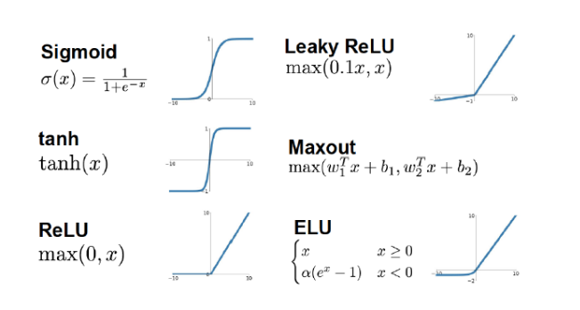
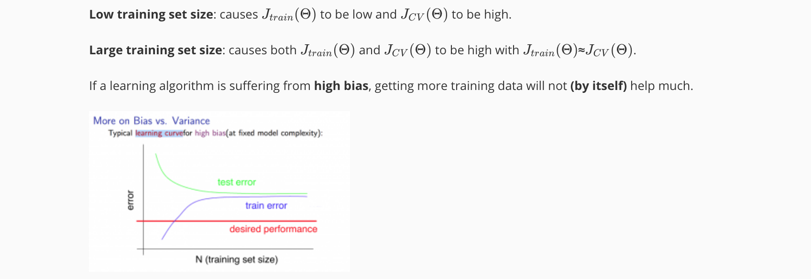
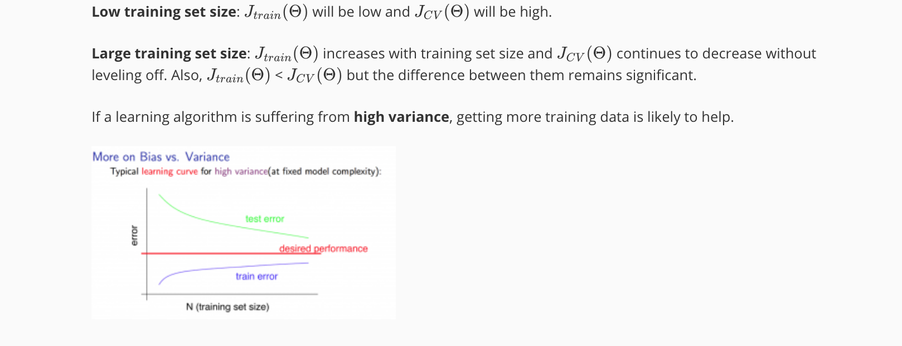

# ML Cheat-sheet - short description of important concepts

## BIAS-VARIANCE 
The bias-variance tradeoff is a problem in supervised learning. 
1. Bias: is an error from erroneous assumptions in the learning algorithm. (difference between expected and actual value)
2. Variance: is an error from sensitivity to small fluctuation in the training set. This can cause an algorithm to model the random noise in the training data 

we’ll say the figure on the left shows an instance of underfitting—in which the data clearly shows structure not captured by the model—and the figure on the right is an example of overfitting.

- **Underfitting, or high bias**, is when the form of our hypothesis function h maps poorly to the trend of the data. It is usually caused by a function that is too simple or uses too few features. 
- **Overfitting, or high variance**, is caused by a hypothesis function that fits the available data but does not generalize well to predict new data. It is usually caused by a complicated function that creates a lot of unnecessary curves and angles unrelated to the data.

## Regularization 
This technique is used to avoid overfitting our model. The overfitting problem can be cause by excessive number of parameter to estimate. The idea is to constrain some of these coefficients in order to shirk them towards zero. To do this we have an additional parameter called Lambda that will decide how much we want to penalise the flexibility of our model and prevents coefficients from rising too high. 

**Ridge L2**

**Lasso L1**

Why it is good? This reduces the variance of the model, without substantial increase in its bias. 
- Lambda = 0, it is like not having any regularization so probably overfitting. 
- Lambda too big, the model starts losing important properties, the bias rises and it's underfitting. 

## Precision and Recall 
1. Precision (also called positive predictive value) is the fraction of relevant instances among the retrieved instances.
2. Recall (also known as sensitivity) is the fraction of relevant instances that have been retrieved over the total amount of relevant instances.

## Type 1 and Type 2 errors 
1. Type1 = \alpha = P(Rejecting the null hypothesis | when it is true)
2. Type2 = \beta = P(fail to reject the null hypothesis | when it is false)

## Gradient Descent 
Gradient descent is iterative optimization algorithm for finding the minimum of a function. To find a local minimum of a function using gradient descent, one takes steps proportional to the negative of the gradient (or approximate gradient) of the function at the current point.

The learning rate alpha is going to give you the speed to reach the local/global minimum. 

The assumption is that the partial derivative will decrease in time so even if the learning rate is fixed. 

## Activation function : why ReLU is better than Sigmoid? 
[Reference1](https://towardsdatascience.com/activation-functions-neural-networks-1cbd9f8d91d6) 
[Reference2](https://stats.stackexchange.com/questions/126238/what-are-the-advantages-of-relu-over-sigmoid-function-in-deep-neural-networks)

The activation function usually is the last node we add to the output end of any neural network. It is used to determine the output of neural netweork like yes or no. It maps the resulting values in between 0 to 1 or -1 to 1 etc. 

Non-linear Activation functions: sigmoid/logistic (0-1), tanh (-1,1), ReLU max(0,a) and Leaky ReLU 

**sigmoid vs ReLU**
Two additional major benefits of ReLUs are sparsity and a reduced likelihood of vanishing gradient. But first recall the definition of a ReLU is h=max(0,a) where a=Wx+b

One major benefit is the reduced likelihood of the gradient to vanish. This arises when a>0. In this regime the gradient has a constant value. In contrast, the gradient of sigmoids becomes increasingly small as the absolute value of x increases. The constant gradient of ReLUs results in faster learning.

The other benefit of ReLUs is sparsity. Sparsity arises when a≤0 The more such units that exist in a layer the more sparse the resulting representation. Sigmoids on the other hand are always likely to generate some non-zero value resulting in dense representations. Sparse representations seem to be more beneficial than dense representations.

**ReLU vs Leaky ReLU** 
The issue with ReLU is that all the negative values become zero immediately which decreases the ability of the model to fit or train from the data properly. That means any negative input given to the ReLU activation function turns the value into zero immediately in the graph, which in turns affects the resulting graph by not mapping the negative values appropriately. The leaky ReLU try to deal with the dying ReLU problem. Instead of not having a slope when x<0, you set a value of (usually) 0.01 so that the line is not perfectly horizontal. 

## Evaluate of the Model
Good practice to avoid overfitting is to divide your dataset into train, validation and test (terminology can vary). Example: 

1. Split your data into training and testing (80/20 is indeed a good starting point)
2. Split the training data into training and validation (again, 80/20 is a fair split).

So that you use the validation set to 'validate' and the test set to 'evaluate' your ML model. Sometimes, especially if the dataset is small, this division can be a problem since the train set dimension is limited. A possible solution is the Cross-Validation: this is a technique that train several ML models on subset of the available dataset and evaluate them on complementary subset of the data. Example of this is the k-fold cross validation. 

- Exhaustive cross-validation : are cross-validation methods which learn and test on all possible ways to divide the original sample into a training and a validation set. (e.g. Leave-p-out cross validation)
- Non-Exhaustive cross validation : do not compute all ways of splitting the original sample. Those methods are approximations of leave-p-out cross-validation. (K-fold cross validation, holdout method)

**Experiencing High Bias**: 

**Experiencing High Variance**: 

